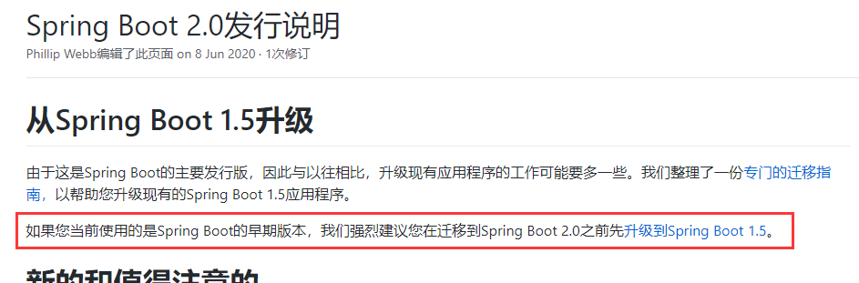
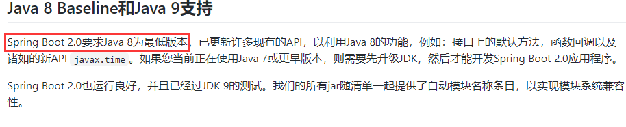

# Spring-cloud学习
## 微服务
### 微服务架构概述

#### 什么事微服务

> #### 微服务架构是一种架构模式，它提倡将单一应用程序划分成一组小的服务，服务之间互相协调，互相配合，为用户提供最终价值。每个服务运行在其独立的进程中，服务与服务简采用轻量级的通信机制互相协作（通常是基于HTTP协议的RESTful API）。每个服务都围绕着具体业务进行构建，并且能够被独立部署到生产环境，类生产环境等。另外，应当尽量避免统一的，集中式的服务管理机制，对具体的一个服务而言，应根据业务上下文选择合适的语言，工具对其进行构建  

#### 微服务架构体系

* 服务注册与发现
* 服务调用
* 服务熔断
* 负载均衡
* 服务降级/熔断
* 服务消息队列
* 配置中心管理
* 服务网关
* 服务监控
* 全链路追踪
* 自动化构建部署
* 服务定时任务调度

### SpringCloud简介

#### 介绍

> #### Spring cloud 是分布式 微服务架构的一站式解决方案，是多种微服务架构落地技术的合集体，俗称微服务全家桶

### SpringCloud技术栈

#### 相关项目

* Spring cloud config: 配置中心
* Spring cloud bus：消息总线
* Eureka: 服务注册与发现
* Hystrix: 熔断器
* Zuul: 网关
* Archaius：配置中心
* Consul: 服务注册与发现
* Spring cloud sleuth: 链路追踪
* Spring cloud data flow：大数据工具
* Spring cloud security：安全
* Spring cloud zookeeper: zookeeper工具包
* Spring cloud stream：数据流开发包
* Spring cloud cli： 脚手架
* Ribbon： 负载均衡
* Feign：服务调用
* Spring cloud Task： 定时任务
* Spring cloud Connectors
* Spring Cloud Cluster
* Spring Cloud Starters: Spring boot 启动项目
* Springcloud for cloud Foundry: Oauth2协议
* Turbine: 事件流

#### 版本选择

* Spring boot 与Spring cloud版本

  * Spring boot使用数字作为版本
  * Spring cloud使用英文单词作为版本

* Spring boot版本选择

  * github源代码地址 [spring boot git hub地址](https://github.com/spring-projects/spring-boot/releases )

  * spring boot 2.0新特性

    * 说明文档：[spring boot 2.0说明文档](https://github.com/spring-projects/spring-boot/wiki/Spring-Boot-2.0-Release-Notes)
    * 强烈简历从1.5升级到2.0 
    * 
    * 最低jdk版本为jdk8 
    * 
    
  * 官网
  
    * [地址](https://spring.io/projects/spring-boot#learn)
  
    * 最稳定版本为 2.4.3，(截止到2021-3-5)
  
      
  
* Spring cloud版本选择

  * github地址 [spring cloud github 地址](https://github.com/spring-projects/spring-cloud/wiki)

  * spring cloud 版本使用单词命名

    

  * > ####  spring cloud采用英国伦敦地铁站的名称来命名，并由地铁站名称A-Z一次类推的形式来发布迭代版本,SpringCloud是一个由许多子项目组成的综合项目，各个子项目有不同的发布节奏。为了管理SpringCloud与各子项目的版本依赖关系，发布了一个清单，包括了某个Spring Cloud版本对应的子项目版本。为了避免SpringCloud版本号与子项目版本号混淆，SpringCloud版本采用了名称而非版本号的命名，这些版本的名字采用了伦敦地铁站的名字，根据字母表的顺序来对应版本时间顺序。例如Angel是第一个版本，Brixton是第二个版本。当SpringCloud的发布内容积累到一个临界点或者一个重大BUG解决后，会发布一个“Service releases”版本，简称SRX版本，比如Greenwich.SR2就是SpringCloud发布的Greenwich版本的第二个SRX版本

* SpringBoot与SpringCloud的依赖关系

  * 说明网址 [官网说明网址](https://spring.io/projects/spring-cloud#overview)

    

  * 更详细的版本对应查看方法

    * [网址](https://start.spring.io/actuator/info)

      

### 关于SpringCloud各种组件的停更/升级/替换

#### 停更不停用

* 被动修复bug
* 不再接受合并请求
* 不再发布新版本

#### 以前

* 服务注册与发现: euraka
* 服务负载均衡与调用：netflix oss ribbon
* 服务负载与调用：netflix feign
* 服务熔断降级：hystrix
* 服务网关：netflix zuul
* 服务分布式配置：Spring cloud config
* 服务开发：Spring boot

#### 现在

* 服务注册中心
  * euraka（停止更新）
  * zookeeper
  * Consul
  * nacos(推荐使用)
* 服务调用
  * Ribbon(进入维护)
  * LoadBalancer(Spring官方替换方案)
* 服务调用
  * Feign(进入维护)
  * OpenFeign(Spring官方替换方案)
* 服务降级
  * Hystrix(进入维护，但是任然在大量使用)
  * resilience4j(官网推荐，国内使用使用少)
  * Spring cloud alibaba sentienl(alibaba开源，国内推荐使用)
* 服务网关
  * Zuul(进入维护)
  * Zuul2(还未出世)
  * gateway(Spring 官方产品，推荐使用)
* 服务配置
  * Spring cloud config(Spring 官方，不推荐使用)
  * nacos(推荐使用)
* 服务总线
  * Spring cloud bus
  * nacos(推荐)

#### 官网

* [spring cloud地址](https://docs.spring.io/spring-cloud/docs/current/reference/html/#appendix-compendium-of-configuration-properties)
* [spring cloud中文文档](https://www.bookstack.cn/read/spring-cloud-docs/README.md)
* [spring boot文档地址](https://docs.spring.io/spring-boot/docs/2.4.3/reference/html/)

### 总结