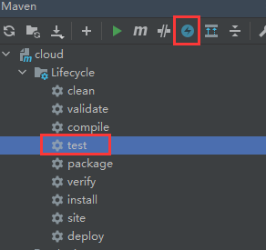

# Spring-cloud学习
## 目录

1. ### [微服务介绍](./README.md)

2. ### [RestTemplate](sections/restTemplate.md)

3. ### [eureka](sections/eureka.md)

4. ### [Zookeeper服务注册与发现](sections/zookeeper.md)

### 微服务架构概述

#### 什么事微服务

> #### 微服务架构是一种架构模式，它提倡将单一应用程序划分成一组小的服务，服务之间互相协调，互相配合，为用户提供最终价值。每个服务运行在其独立的进程中，服务与服务简采用轻量级的通信机制互相协作（通常是基于HTTP协议的RESTful API）。每个服务都围绕着具体业务进行构建，并且能够被独立部署到生产环境，类生产环境等。另外，应当尽量避免统一的，集中式的服务管理机制，对具体的一个服务而言，应根据业务上下文选择合适的语言，工具对其进行构建  

#### 微服务架构体系

* 服务注册与发现
* 服务调用
* 服务熔断
* 负载均衡
* 服务降级/熔断
* 服务消息队列
* 配置中心管理
* 服务网关
* 服务监控
* 全链路追踪
* 自动化构建部署
* 服务定时任务调度

### SpringCloud简介

#### 介绍

> #### Spring cloud 是分布式 微服务架构的一站式解决方案，是多种微服务架构落地技术的合集体，俗称微服务全家桶

### SpringCloud技术栈

#### 相关项目

* Spring cloud config: 配置中心
* Spring cloud bus：消息总线
* Eureka: 服务注册与发现
* Hystrix: 熔断器
* Zuul: 网关
* Archaius：配置中心
* Consul: 服务注册与发现
* Spring cloud sleuth: 链路追踪
* Spring cloud data flow：大数据工具
* Spring cloud security：安全
* Spring cloud zookeeper: zookeeper工具包
* Spring cloud stream：数据流开发包
* Spring cloud cli： 脚手架
* Ribbon： 负载均衡
* Feign：服务调用
* Spring cloud Task： 定时任务
* Spring cloud Connectors
* Spring Cloud Cluster
* Spring Cloud Starters: Spring boot 启动项目
* Springcloud for cloud Foundry: Oauth2协议
* Turbine: 事件流

#### 版本选择

* Spring boot 与Spring cloud版本

  * Spring boot使用数字作为版本
  * Spring cloud使用英文单词作为版本

* Spring boot版本选择

  * github源代码地址 [spring boot git hub地址](https://github.com/spring-projects/spring-boot/releases )

  * spring boot 2.0新特性

    * 说明文档：[spring boot 2.0说明文档](https://github.com/spring-projects/spring-boot/wiki/Spring-Boot-2.0-Release-Notes)
    * 强烈简历从1.5升级到2.0 
    * 
    * 最低jdk版本为jdk8 
    * 
    
  * 官网
  
    * [地址](https://spring.io/projects/spring-boot#learn)
  
    * 最稳定版本为 2.4.3，(截止到2021-3-5)
  
      
  
* Spring cloud版本选择

  * github地址 [spring cloud github 地址](https://github.com/spring-projects/spring-cloud/wiki)

  * spring cloud 版本使用单词命名

    

  * > ####  spring cloud采用英国伦敦地铁站的名称来命名，并由地铁站名称A-Z一次类推的形式来发布迭代版本,SpringCloud是一个由许多子项目组成的综合项目，各个子项目有不同的发布节奏。为了管理SpringCloud与各子项目的版本依赖关系，发布了一个清单，包括了某个Spring Cloud版本对应的子项目版本。为了避免SpringCloud版本号与子项目版本号混淆，SpringCloud版本采用了名称而非版本号的命名，这些版本的名字采用了伦敦地铁站的名字，根据字母表的顺序来对应版本时间顺序。例如Angel是第一个版本，Brixton是第二个版本。当SpringCloud的发布内容积累到一个临界点或者一个重大BUG解决后，会发布一个“Service releases”版本，简称SRX版本，比如Greenwich.SR2就是SpringCloud发布的Greenwich版本的第二个SRX版本

* SpringBoot与SpringCloud的依赖关系

  * 说明网址 [官网说明网址](https://spring.io/projects/spring-cloud#overview)

    

  * 更详细的版本对应查看方法

    * [网址](https://start.spring.io/actuator/info)

      

### 关于SpringCloud各种组件的停更/升级/替换

#### 停更不停用

* 被动修复bug
* 不再接受合并请求
* 不再发布新版本

#### 以前

* 服务注册与发现: euraka
* 服务负载均衡与调用：netflix oss ribbon
* 服务负载与调用：netflix feign
* 服务熔断降级：hystrix
* 服务网关：netflix zuul
* 服务分布式配置：Spring cloud config
* 服务开发：Spring boot

#### 现在

* 服务注册中心
  * euraka（停止更新）
  * zookeeper
  * Consul
  * nacos(推荐使用)
* 服务调用
  * Ribbon(进入维护)
  * LoadBalancer(Spring官方替换方案)
* 服务调用
  * Feign(进入维护)
  * OpenFeign(Spring官方替换方案)
* 服务降级
  * Hystrix(进入维护，但是任然在大量使用)
  * resilience4j(官网推荐，国内使用使用少)
  * Spring cloud alibaba sentienl(alibaba开源，国内推荐使用)
* 服务网关
  * Zuul(进入维护)
  * Zuul2(还未出世)
  * gateway(Spring 官方产品，推荐使用)
* 服务配置
  * Spring cloud config(Spring 官方，不推荐使用)
  * nacos(推荐使用)
* 服务总线
  * Spring cloud bus
  * nacos(推荐)


#### 官网

* [spring cloud地址](https://docs.spring.io/spring-cloud/docs/current/reference/html/#appendix-compendium-of-configuration-properties)
* [spring cloud中文文档](https://www.bookstack.cn/read/spring-cloud-docs/README.md)
* [spring boot文档地址](https://docs.spring.io/spring-boot/docs/2.4.3/reference/html/)

### 总结

## 编码

### 项目的构建

#### 约定 > 配置 > 编码

#### IDEA新建project工作空间

* 先建立一个总父工程
* 其次 在建立子工程
  1. new Project
     * file -> New -> Project
     * 
  2. 选择创建maven项目，使用maven-archetype-site模板
     * 
  3. group id 统一为cn.fenqing168.springcloud
     *  
  4. maven尽量采用3.5以上，以及settings.xml尽量设置国内镜像
     *  
  5. 设置项目字符编码
     *  
     *  
  6. 注解激活生效
     *  
     *  
  7. java编译版本选8
     *  ****
     *  

#### 父工程的pom文件修改

1. 修改packageing为pom

   * ```
     <packaging>pom</packaging>
     ```

2. 把这个项目当做总的依赖版本控制，写上properties标签，与dependencyManagement标签，后续需要用到什么回头在添加

   * ```xml
     <properties>
         <project.build.sourceEncoding>UTF-8</project.build.sourceEncoding>
         <maven.compiler.source>8</maven.compiler.source>
         <maven.compiler.target>8</maven.compiler.target>
     </properties>
     
     <dependencyManagement></dependencyManagement>
     ```

3. maven 跳过单元测试

   * 


### Rest微服务工程构建

#### 项目结构

* 客户端消费者80 order
* 微服务提供者8001 payment
* 

#### 建微服务模块流程

* 建module
* 改pom
* 写yml
* 主启动
* 业务类

#### 微服务提供者支付模块

* 创建子模块maven项目cloud-provider-payment8001

* 修改pom

  * mybatis-spring-boot-starter由于不在仲裁中心之内，查阅文档得知，最新的版本只要Spring boot版本大于2.1即可使用

    * [mybatis-spring-boot-starter git hub网址](https://github.com/mybatis/spring-boot-starter)
    * 
    * 所以采用最新版2.1.4（截止2021-3-6）
    * 

  * 先给父工程里的dependencyManagement追加相对于的依赖

  * ```xml
    <!--spring boot 仲裁中心-->
    <dependency>
        <groupId>org.springframework.boot</groupId>
        <artifactId>spring-boot-dependencies</artifactId>
        <version>${spring-boot.version}</version>
        <type>pom</type>
        <scope>import</scope>
    </dependency>
    
    <!--mybatis spring boot 自动配置-->
    <dependency>
        <groupId>org.mybatis.spring.boot</groupId>
        <artifactId>mybatis-spring-boot-starter</artifactId>
        <version>${mybatis-spring-boot.version}</version>
    </dependency>
    
    ```

  * 给父工程的properties追加相对于的版本号

  * ```xml
    <spring-boot.version>2.2.13.RELEASE</spring-boot.version>
    <mybatis-spring-boot.version>2.1.4</mybatis-spring-boot.version>
    ```

  * 子工程中引入相关依赖

  * ```xml
    <dependencies>
        <!--spring boot web 的自动配置依赖-->
        <dependency>
            <groupId>org.springframework.boot</groupId>
            <artifactId>spring-boot-starter-web</artifactId>
        </dependency>
        <!-- spring boot 监控系统健康 -->
        <dependency>
            <groupId>org.springframework.boot</groupId>
            <artifactId>spring-boot-starter-actuator</artifactId>
        </dependency>
        <!-- mybatis自动配置依赖 -->
        <dependency>
            <groupId>org.mybatis.spring.boot</groupId>
            <artifactId>mybatis-spring-boot-starter</artifactId>
        </dependency>
        <!-- druid数据源自动配置依赖 -->
        <dependency>
            <groupId>com.alibaba</groupId>
            <artifactId>druid-spring-boot-starter</artifactId>
        </dependency>
    
        <!-- mysql驱动 -->
        <dependency>
            <groupId>mysql</groupId>
            <artifactId>mysql-connector-java</artifactId>
        </dependency>
    
        <!-- spring boot jdbc 自动配置-->
        <dependency>
            <groupId>org.springframework.boot</groupId>
            <artifactId>spring-boot-starter-jdbc</artifactId>
        </dependency>
    
        <!-- lombok插件 -->
        <dependency>
            <groupId>org.projectlombok</groupId>
            <artifactId>lombok</artifactId>
            <scope>compile</scope>
        </dependency>
    
        <!-- spring boot 单元测试 -->
        <dependency>
            <groupId>org.springframework.boot</groupId>
            <artifactId>spring-boot-starter-test</artifactId>
        </dependency>
    
    </dependencies>
    ```
  
* 写YML

  * ```yaml
    server:
      port: 8001
    
    spring:
      application:
        name: cloud-payment-service
    
      datasource:
        type: com.alibaba.druid.pool.DruidDataSource
        driver-class-name: com.mysql.cj.jdbc.Driver
        url: jdbc:mysql://192.168.31.200/mysql/useUnicode=true&characterEncoding=utf-8&useSSL=false
        username: root
        password: 123456
    
    mybatis:
      mapper-locations: classpath*:mapper/*.xml
      type-aliases-package: cn.fenqing168.springcloud.entities
    ```

* 主启动

  * ```java
    @SpringBootApplication
    public class PaymentApplication {
    
        public static void main(String[] args) {
            SpringApplication.run(PaymentApplication.class, args);
        }
        
    }
    ```

* 编写业务

  * 创建数据库表

    * ```sql
      CREATE TABLE `payment` (
        `id` bigint NOT NULL AUTO_INCREMENT COMMENT '主键',
        `serial` varchar(200) DEFAULT NULL,
        PRIMARY KEY (`id`)
      ) ENGINE=InnoDB DEFAULT CHARSET=utf8mb4 COLLATE=utf8mb4_0900_ai_ci;
      ```

  * 实体类

    * ```java
      @Data
      @AllArgsConstructor
      @NoArgsConstructor
      public class Payment {
      
          private Long id;
      
          private String serial;
      
      }
      ```

  * 接口统一返回对象

    * ```java
      @Data
      @NoArgsConstructor
      @AllArgsConstructor
      public class BaseResult<T> {
      
          private Integer code;
          private T data;
          private String msg;
      
          public static <T> BaseResult<T> success(){
              return success(null);
          }
      
          public static <T> BaseResult<T> success(T data){
              return success(data, "success");
          }
      
          public static <T> BaseResult<T> success(T data, String msg){
              return new BaseResult<>(200, data, msg);
          }
      
          public static <T> BaseResult<T> error(){
              return error(null);
          }
      
          public static <T> BaseResult<T> error(T data){
              return error(data, "error");
          }
      
          public static <T> BaseResult<T> error(T data, String msg){
              return new BaseResult<>(500, data, msg);
          }
      
      
      }
      ```

  * dao

    * dao接口

      * ```java
        /**
         * @author Administrator
         */
        @Mapper
        public interface PaymentDao {
        
            /**
             * 添加
             * @param payment 实体
             * @return 影响条数
             */
            int insert(Payment payment);
        
            /**
             * 查询
             * @param id id
             * @return 查询到的结果
             */
            Payment getById(@Param("id") Long id);
        
        }
        ```

    * mapper.xml

      * ```xml
        <?xml version="1.0" encoding="UTF-8" ?>
        <!DOCTYPE mapper PUBLIC "-//mybatis.org//DTD Mapper 3.0//EN" "http://mybatis.org/dtd/mybatis-3-mapper.dtd" >
        <mapper namespace="cn.fenqing168.springcloud.dao.PaymentDao">
        
            <resultMap id="BaseResultMap" type="cn.fenqing168.springcloud.entities.Payment">
                <id column="id" property="id" jdbcType="BIGINT"/>
                <id column="serial" property="serial" jdbcType="VARCHAR"/>
            </resultMap>
        
            <insert id="insert" useGeneratedKeys="true" keyProperty="id" keyColumn="id">
                insert into payment(serial) values (#{serial})
            </insert>
        
            <select id="getById" resultMap="BaseResultMap">
                select * from payment where id = #{id}
            </select>
        </mapper>
        ```

  * service

    * 接口

      * ```java
        public interface IPaymentService {
        
            /**
             * 添加
             * @param payment 实体
             * @return 影响条数
             */
            int insert(Payment payment);
        
            /**
             * 查询
             * @param id id
             * @return 查询到的结果
             */
            Payment getById(Long id);
            
        }
        ```

    * 实现类

      * ```java
        @Service
        public class PaymentServiceImpl implements IPaymentService {
        
            @Autowired
            private PaymentDao paymentDao;
        
            @Override
            public int insert(Payment payment) {
                return paymentDao.insert(payment);
            }
        
            @Override
            public Payment getById(Long id) {
                return paymentDao.getById(id);
            }
        }
        ```

  * controller

    * ```java
      @RestController
      @Slf4j
      public class PaymentController {
      
          @Autowired
          private IPaymentService iPaymentService;
      
          /**
           * 添加
           *
           * @param payment 实体
           * @return 影响条数
           */
          @PostMapping("/payment/create")
          public BaseResult<Integer> insert(@RequestBody Payment payment) {
              int res = iPaymentService.insert(payment);
              log.info("****插入结果：{}", res);
              if (res > 0) {
                  return BaseResult.success(null, "插入数据库成功");
              } else {
                  return BaseResult.error(null, "插入数据库失败");
              }
          }
      
          /**
           * 查询
           *
           * @param id id
           * @return 查询到的结果
           */
          @GetMapping("/payment/get/{id}")
          public BaseResult<Payment> getById(@PathVariable("id") Long id) {
              Payment payment = iPaymentService.getById(id);
              if (payment != null) {
                  return BaseResult.success(payment, "查询成功");
              } else {
                  return BaseResult.error(null, "查询失败");
              }
          }
      
      }
      ```


#### 微服务消费者订单模块

* 建module cloud-cpnsumer-order80

* 写pom

  * ```xml
      <dependencies>
        <!--spring boot web 的自动配置依赖-->
        <dependency>
          <groupId>org.springframework.boot</groupId>
          <artifactId>spring-boot-starter-web</artifactId>
        </dependency>
        <!-- spring boot 监控系统健康 -->
        <dependency>
          <groupId>org.springframework.boot</groupId>
          <artifactId>spring-boot-starter-actuator</artifactId>
        </dependency>
        <!-- mybatis自动配置依赖 -->
        <dependency>
          <groupId>org.mybatis.spring.boot</groupId>
          <artifactId>mybatis-spring-boot-starter</artifactId>
        </dependency>
        <!-- druid数据源自动配置依赖 -->
        <dependency>
          <groupId>com.alibaba</groupId>
          <artifactId>druid-spring-boot-starter</artifactId>
        </dependency>
      
        <!-- mysql驱动 -->
        <dependency>
          <groupId>mysql</groupId>
          <artifactId>mysql-connector-java</artifactId>
        </dependency>
      
        <!-- spring boot jdbc 自动配置-->
        <dependency>
          <groupId>org.springframework.boot</groupId>
          <artifactId>spring-boot-starter-jdbc</artifactId>
        </dependency>
      
        <!-- lombok插件 -->
        <dependency>
          <groupId>org.projectlombok</groupId>
          <artifactId>lombok</artifactId>
          <scope>compile</scope>
        </dependency>
      
        <!-- spring boot 单元测试 -->
        <dependency>
          <groupId>org.springframework.boot</groupId>
          <artifactId>spring-boot-starter-test</artifactId>
        </dependency>
      
      </dependencies>
    ```

* 改yml

  * ```yaml
    server:
      port: 80
    ```

* 主启动

  * ```java
    @SpringBootApplication
    public class OrderApplication {
    
        public static void main(String[] args) {
            SpringApplication.run(OrderApplication.class, args);
        }
        
    }
    ```

* 业务类

  * 将实体类与统一返回对象拷贝过来

  * 写controller

  * > 由于订单需要调用支付模块，在原始的方法中可以使用httpClient或者okHttp等http工具，在Springboot中可以使用restTemplate,详情见[restTemplate](#RestTemplate)

  * restTemplate注册到容器中

    * ```java
      @Configuration
      public class ApplicationContextConfig {
      
          @Bean
          public RestTemplate getRestTemplate(){
              return new RestTemplate();
          }
          
      }
      
      ```

  * ```java
    @RestController
    @Slf4j
    public class OrderController {
    
        public final static String PAYMENT_URL = "http://localhost:8001";
    
        @Autowired
        public RestTemplate restTemplate;
    
        @PostMapping("/consumer/payment/create")
        public BaseResult<Integer> create(@RequestBody Payment payment){
            HttpHeaders headers = new HttpHeaders();
            MediaType type = MediaType.parseMediaType("application/json; charset=UTF-8");
            headers.setContentType(type);
            headers.add("Accept", MediaType.APPLICATION_JSON.toString());
            HttpEntity<String> formEntity = new HttpEntity<>(JSONObject.toJSONString(payment), headers);
            return restTemplate.postForObject(PAYMENT_URL + "/payment/create", formEntity, BaseResult.class);
        }
    
        @GetMapping("/consumer/payment/get/{id}")
        public BaseResult<Payment> get(@PathVariable Long id){
            HttpHeaders headers = new HttpHeaders();
            MediaType type = MediaType.parseMediaType("application/json; charset=UTF-8");
            headers.setContentType(type);
            headers.add("Accept", MediaType.APPLICATION_JSON.toString());
            return restTemplate.getForObject(PAYMENT_URL + "/payment/get/" + id, BaseResult.class);
        }
    }
    ```

#### 工程重构

* 存在的问题
  * 有可以通用的类可以抽取

* 抽取通用工程cloud-api-commons，用于存放共用的类
* 其他项目依赖cloud-api-commons项目，删除共用的类

## 后续工作见各组件目录补充

1. [eureka](#eureka)
2. [zookeeper](#Zookeeper服务注册与发现)