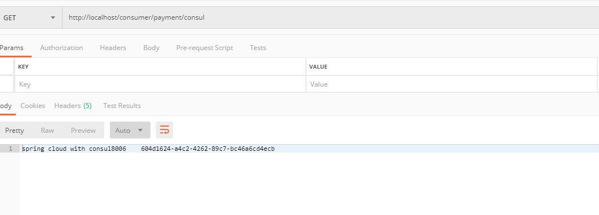

# Consul

## Consul简介  

### 是什么 

* [官网地址](https://www.consul.io/docs/intro)
* consul是一套开源的分布式服务发现和配置管理系统，由HashiCorp公司使用Go语言开发
* 提供了微服务系统的**服务治理，配置中心，控制总线**等功能。这些功能中的每一个都可以根据需要单独使用，也可以一起使用以构建全方位的服务网络，总之Consul提供了一种完整的服务网格解决方案
* 他具有很多有点，包括：基于raft协议，比较简洁；支持健康检查，同事支持Http和Dns协议，支持跨数据中心的WAN集群，提供图形化界面，跨平台，支持Linux，Mac，windows

### 能干嘛 

* 
* 

### 去哪下 

* 直接官网下载即可

### 怎么玩

* springcloud官网：[consul 文档](https://spring.io/projects/spring-cloud-consul)
* 中文版：[consul 文档](https://www.springcloud.cc/spring-cloud-consul.html)

## 安装并运行Consul 

* 根据官网教程安装
* 使用docker hub拉取镜像安装

## 服务提供者 

* 新建Module支付服务privider8006

* pom

  * 其他的不变，将注册中心相关的依赖换成spring-cloud-starter-consul-discovery

  * ```xml
    <!-- consul 的spring cloud依赖 -->
    <dependency>
        <groupId>org.springframework.cloud</groupId>
        <artifactId>spring-cloud-starter-consul-discovery</artifactId>
    </dependency>
    ```

* yml

  * ```yaml
    server:
      port: 8006
    
    spring:
      application:
        name: cloud-provider-payment
      cloud:
        # consul 相关配置
        consul:
          host: 192.168.31.200
          port: 8500
          discovery:
            service-name: ${spring.application.name}
            # 使用ip地址，默认为主机名
            prefer-ip-address: true
    ```

* 主启动类

  * ```java
    @SpringBootApplication
    @EnableDiscoveryClient
    public class PaymentApplication {
    
        public static void main(String[] args) {
            SpringApplication.run(PaymentApplication.class, args);
        }
    
    }
    ```

* 业务类Controller

  * ```java
    @RestController
    @Slf4j
    public class PaymentController {
    
        @Value("${server.port}")
        private String port;
    
        @GetMapping("/payment/consul")
        public String insert() {
            return "spring cloud with consul" + port + "\t" + UUID.randomUUID().toString();
        }
    
    
    }
    ```

* 验证测试

## 服务消费者 

* 新建module消费服务order80

* pom

  * 加上spring-cloud-starter-consul-discovery

* yml

  * ```yaml
    server:
      port: 80
    
    spring:
      application:
        name: cloud-consumer-order
      cloud:
        # consul 相关配置
        consul:
          host: 192.168.31.200
          port: 8500
          discovery:
            service-name: ${spring.application.name}
            # 使用ip地址，默认为主机名
            prefer-ip-address: true
    ```

* 主启动

  * ```java
    @SpringBootApplication
    @EnableDiscoveryClient
    public class OrderApplication {
    
        public static void main(String[] args) {
            SpringApplication.run(OrderApplication.class, args);
        }
    
    }
    ```

* 配置bean

  * ```java
    @Configuration
    public class ApplicationContextConfig {
    
        @Bean
        @LoadBalanced
        public RestTemplate getRestTemplate(){
            return new RestTemplate();
        }
    
    }
    ```

* controller

  * ```java
    @RestController
    public class OrderConsulController {
    
        @Autowired
        private RestTemplate restTemplate;
    
        private static final String INVOKE_URL = "http://cloud-provider-payment";
    
        @GetMapping("/consumer/payment/consul")
        public String paymentInfo(){
            return restTemplate.getForObject(INVOKE_URL + "/payment/consul", String.class);
        }
    
    }
    ```

* 验证测试

  * 

* 访问测试地址

