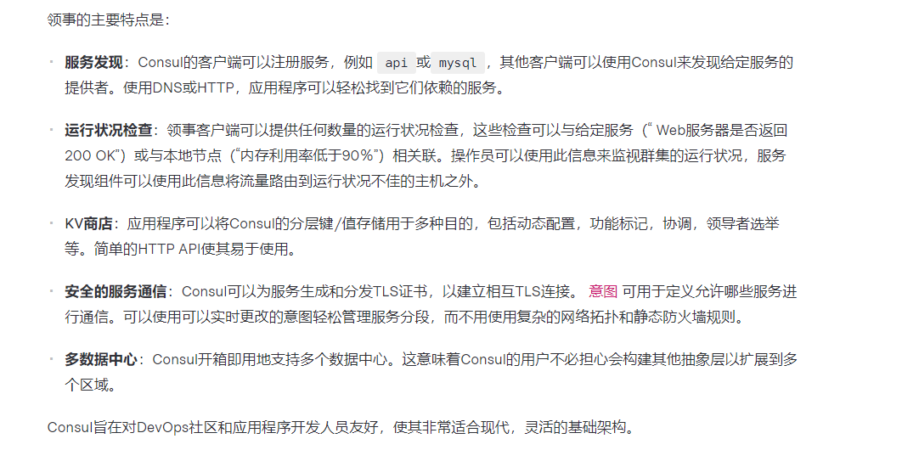

# Consul

## Consul简介  

### 是什么 

* [官网地址](https://www.consul.io/docs/intro)
* consul是一套开源的分布式服务发现和配置管理系统，由HashiCorp公司使用Go语言开发
* 提供了微服务系统的**服务治理，配置中心，控制总线**等功能。这些功能中的每一个都可以根据需要单独使用，也可以一起使用以构建全方位的服务网络，总之Consul提供了一种完整的服务网格解决方案
* 他具有很多有点，包括：基于raft协议，比较简洁；支持健康检查，同事支持Http和Dns协议，支持跨数据中心的WAN集群，提供图形化界面，跨平台，支持Linux，Mac，windows

### 能干嘛 

* 
* 

### 去哪下 

* 直接官网下载即可

### 怎么玩

* springcloud官网：[consul 文档](https://spring.io/projects/spring-cloud-consul)
* 中文版：[consul 文档](https://www.springcloud.cc/spring-cloud-consul.html)

## 安装并运行Consul 

## 服务提供者 

## 服务消费者 

## 三个注册中心异同点