# eureka

## 基础知识

### 什么是服务治理

* Spring cloud 封装了Netflix公司开发的Eureka模块来实现服务治理
* 在传统的rpc远程调用框架中，管理每个服务与服务之间的依赖关系比较复杂，管理比较复杂，所以需要使用服务治理，管理服务与服务之间的依赖关系，可以实现服务调用，负载均衡，容错等，实现服务发现与注册

### 什么是服务注册

* **eureka采用了cs的设计架构，Eureka server 作为服务注册功能的服务器，他是服务注册中心。而系统中的其他微服务，使用Eureka的客户端链接到Eureka server并维持心跳连接。这样系统的维护人员就可以通过Eureka server 来监控系统中各个微服务是否正常运行**
* **在服务注册与发现中，有一个注册中心，当服务器启动的时候，会吧当前自己的服务器的详细，比如服务地址通讯地址等以别名方式注册到注册中心。另一方（消费者|服务提供者），以该别名的方式去注册中心上获取到实际的服务通讯地址，然后再实现本地RPC调用。RPC远程调用框架核心设计思想：在于注册中心，因为使用注册中心管理每个服务与服务之间的一个依赖关系（服务治理概念）。在任何RPC远程框架中。都会有一个注册中心（存放服务地址相关信息（接口地址））**

* 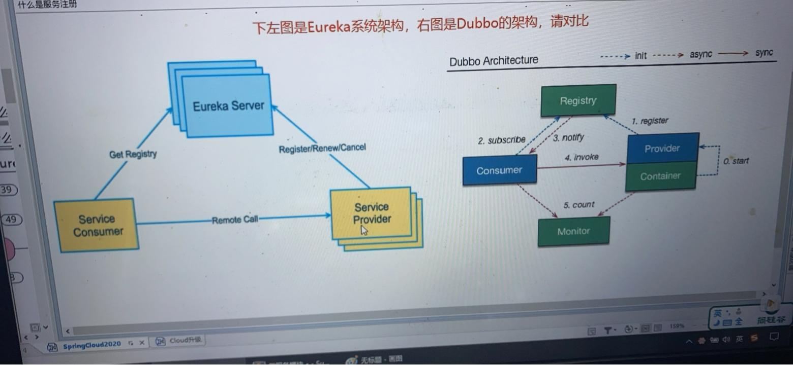

## Eureka的两个组件：Eureka Server和Eureka Client

### Eureka Server 提供服务注册

* **各个微服务节点通过配置启动后，会在EurekaServer中进行注册，这样EurekaServer中的服务注册表将会存储所有可用服务节点信息，服务节点的信息可以在界面中直观看到**

### EurekaClient通过注册中心进行访问

是一个Java客户端，用于简化EurekaServer的交互，客户端同时也具备一个内置的，使用轮询（round-robin）负载算法的负载均衡器。在应用启动后，将会向Eureka Server发送心跳（周期是30秒）。如果Eureka Server 在多个心跳周期内没有接收到某个节点的心跳，EurekaServer将会从服务注册表中把这个服务节点移除（默认90秒）

## 单机Eureka搭建

### 创建EurekaServer注册中心工程

#### 建Model 

* 创建maven项目cloud-eureka-server7001

#### 改POM 

* eureka的1.x与2.x的区别

  * 老版本采用spring-cloud-starter-eureka
  * 新版本采用spring-cloud-start-netflix-eureka-server（对server与client做了细分）

* 由于Spring boot采用2.2.13.RELEASE版本，在Spring官方提供的依赖关系查询中得知，可以使用**Hoxton.SR10**的版本

* 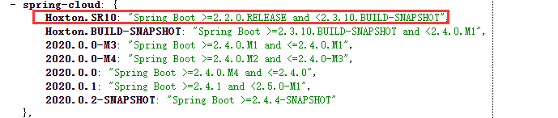

* 引入在父工程补充Hoxton.SR10的Spring cloud 依赖仲裁工程

* ```xml
  <spring.cloud.version>Hoxton.SR10</spring.cloud.version>
  ```

* ```xml
  <!-- spring cloud 依赖管理仲裁项目-->
  <dependency>
      <groupId>org.springframework.cloud</groupId>
      <artifactId>spring-cloud-dependencies</artifactId>
      <version>${spring.cloud.version}</version>
      <type>pom</type>
      <scope>import</scope>
  </dependency>
  ```

* 在cloud-eureka-server7001项目中添加基本web环境的同时加上eureka-server的starter

* ```xml
  <dependencies>
      <!--spring boot web 的自动配置依赖-->
      <dependency>
          <groupId>org.springframework.boot</groupId>
          <artifactId>spring-boot-starter-web</artifactId>
      </dependency>
      <!-- spring boot 监控系统健康 -->
      <dependency>
          <groupId>org.springframework.boot</groupId>
          <artifactId>spring-boot-starter-actuator</artifactId>
      </dependency>
  
      <!-- spring boot 单元测试 -->
      <dependency>
          <groupId>org.springframework.boot</groupId>
          <artifactId>spring-boot-starter-test</artifactId>
      </dependency>
  
      <!-- eureka server 组件 -->
      <dependency>
          <groupId>org.springframework.cloud</groupId>
          <artifactId>spring-cloud-starter-netflix-eureka-server</artifactId>
      </dependency>
  
  </dependencies>
  ```

#### 写YML 

* ```yaml
  server:
    port: 7001
  
  eureka:
    instance:
      hostname: localhost # eureka服务端的实例名称
  
    client:
      # 是否将自己注册到注册中心
      register-with-eureka: false
      # 是否是否需要去检索服务，由于当前是注册中心，不需要去服务发现与调用
      fetch-registry: false
      # 是一个Map<String, String>，defaultZone可以指定交互的地址查询服务和注册服务的地址
      service-url:
        # 提供暴露的地址，客户端通过该地址来连接并且注册
        defaultZone: http://${eureka.instance.hostname}:${server.port}/eureka/
  ```

#### 主启动 

* ```java
  /**
   * 通过EnableEurekaServer来开启注册中心服务功能
   * @author Administrator
   */
  @SpringBootApplication
  @EnableEurekaServer
  public class EurekaApplication {
  
      public static void main(String[] args) {
          SpringApplication.run(EurekaApplication7001.class, args);
      }
  
  }
  ```

* 

#### 测试

* 浏览器输入 http://localhost:7001/
* 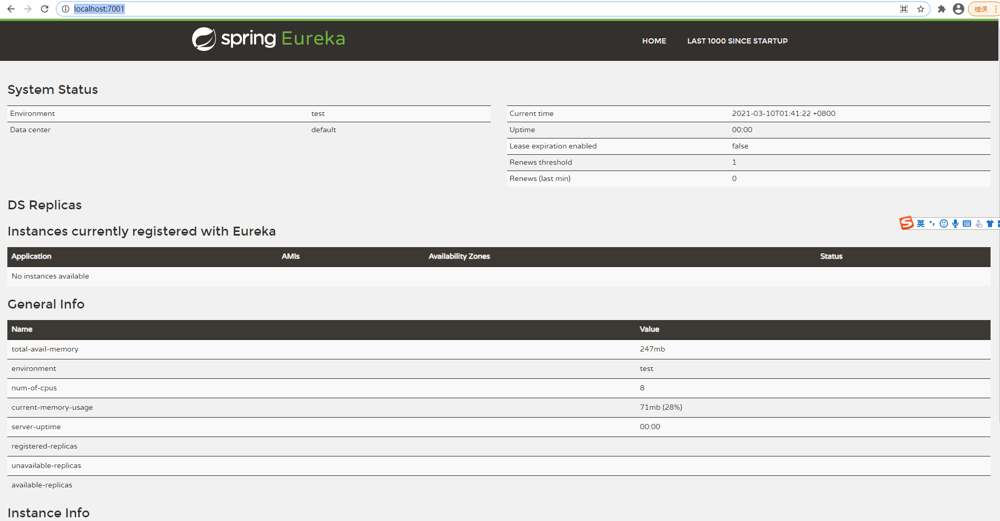

### EurekaClient端payment8001注册进EurekaServer成为服务提供者

#### 改POM 

* eureka的1.x与2.x的区别
  * 老版本采用spring-cloud-starter-eureka
  * 新版本采用spring-cloud-start-netflix-eureka-client（对server与client做了细分）

* 在payment8001项目中POM里补充eureka-client的starter

* ```xml
   <!-- spring cloud eureka 客户端组件 -->
  <dependency>
      <groupId>org.springframework.cloud</groupId>
      <artifactId>spring-cloud-starter-netflix-eureka-client</artifactId>
  </dependency>
  ```

* 

#### 写YML 

* ```yaml
  eureka:
    client:
      # 向注册中心注册自己
      register-with-eureka: true
      # 需要服务发现功能
      fetch-registry: true
      # 是一个Map<String, String>，defaultZone可以指定交互的地址查询服务和注册服务的地址
      service-url:
        # 通过这个地址与注册中心保存连接与注册
        defaultZone: http://localhost:7001/eureka
  ```

#### 主启动

* 在类上补充注解@EnableEurekaClient

#### 测试 

* 浏览器启动项目，并且观察注册中心可视化界面的变化
* 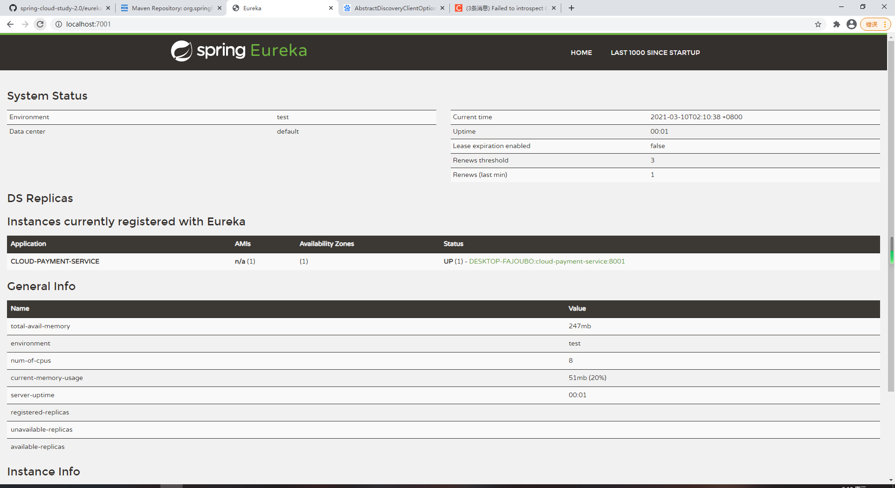
* 微服务的注册名称配置说明，即spring.application.name
  * 微服务会以spring.application.name作为微服务名

### EurekaClient端Order80注册进EurekaServer成为服务消费者

#### POM 

* 与payment8001一样的改动

#### YML 

* 与payment8001一样的改动

#### 主启动 

* 与payment8001一样的改动

#### 测试

* 启动后观察注册中心变化
* 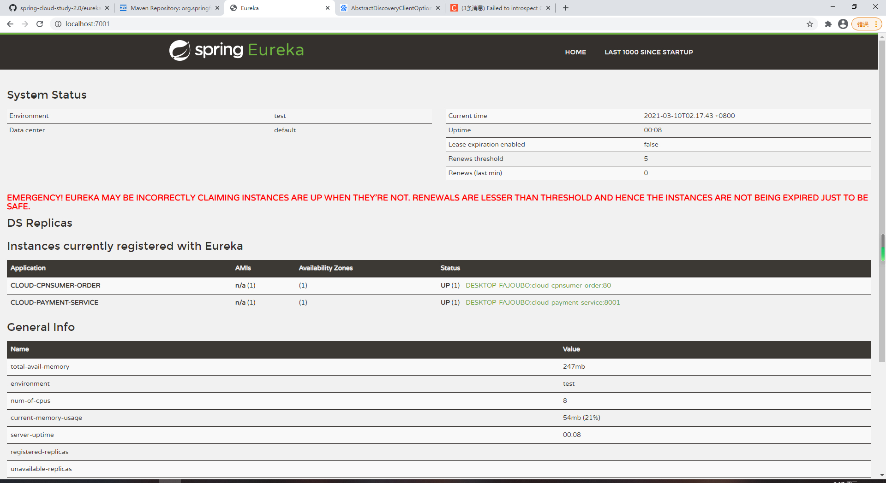

## 集群Eureka构建步骤

### Eureka集群原理说明 

* 注册中心是微服务的核心组件，服务发现与调用都离不了它。如果他宕机了则会引起整个微服务环境不可用
* 解决方案：搭建集群
* 集群的原理
  * 互相注册，相互守望

### EurekaServer集群环境构建步骤 

* 新建cloud-eureka-server7002

* 改pom

  * 与cloud-eureka-server7001

* 修改映射配置

  * 修改windows下的hosts文件，分别给两个域名

  * 在 C:\Windows\System32\drivers\etc\hosts文件 追加两行

  * ``````
    127.0.0.1 eureka1.fq.com
    127.0.0.1 eureka2.fq.com
    ``````

* 写YML

  * 与单机版差不多，但eureka.instance.hostname要有所区分，但是通过次标识能指向本机

  * eureka.client.service-url.defaultZone的地址应该写其他的eureka地址

  * ```yaml
    server:
      port: 7002
    eureka:
      instance:
        hostname: eureka2.fq.com # eureka服务端的实例名称
      client:
        # 是否将自己注册到注册中心
        register-with-eureka: false
        # 是否是否需要去检索服务，由于当前是注册中心，不需要去服务发现与调用
        fetch-registry: false
        # 是一个Map<String, String>，defaultZone可以指定交互的地址查询服务和注册服务的地址
        service-url:
          # 注册到7001
          defaultZone: http://eureka1.fq.com:7001/eureka/
    ```

  * ```yaml
    server:
      port: 7001
    
    eureka:
      instance:
        hostname: eureka1.fq.com # eureka服务端的实例名称
    
      client:
        # 是否将自己注册到注册中心
        register-with-eureka: false
        # 是否是否需要去检索服务，由于当前是注册中心，不需要去服务发现与调用
        fetch-registry: false
        # 是一个Map<String, String>，defaultZone可以指定交互的地址查询服务和注册服务的地址
        service-url:
          # 注册到7002
          defaultZone: http://eureka2.fq.com:7002/eureka/
    ```

  * 

* 主启动

  * 与cloud-eureka-server7001一致
  * 访问浏览器效果
  * 7001
  * 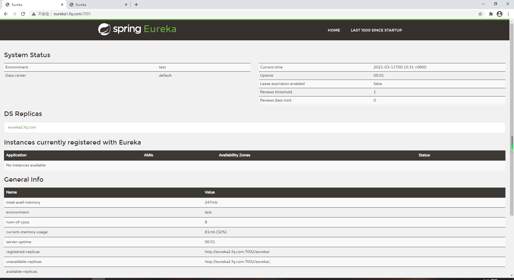
  * 7002
  * 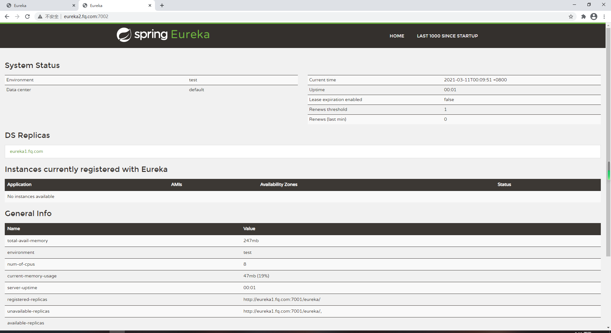
  * 可以发现DS Replicas是相互注册的

### 将支付模块微服务发布到两台Eureka集群 

* 只需要改动YML的eureka.service-url.defaultZone，改成两个eureka的地址，用逗号分割

### 将订单服务发布到2台集群中 测试01 

* 只需要改动YML的eureka.service-url.defaultZone，改成两个eureka的地址，用逗号分割

### 支付服务提供者8001集群环境构建 

* 客户端也可以集群配置，

* 新建payment8002

  * 改POM，与8001的一致

  * 写YML，与8001的一致，修改端口，要想达成集群的效果，spring.application.name要保持一致

  * 主启动

  * 业务类

  * 修改8001/8002的Controller

    * 注入端口号，查询成功后返回结果加上端口号，查看效果

    * ```java
      @Value("${server.port}")
      private String port;
      return BaseResult.success(payment, "查询成功：" + port);
      ```

    * 将消费者80的请求地址由写死的换成微服务名称，注册中心会自动寻找ip和端口

      ```java
      public final static String PAYMENT_URL = "http://CLOUD-PAYMENT-SERVICE";
      ```

    * 但是会报 java.net.UnknownHostException: CLOUD-PAYMENT-SERVICE"异常

    * 因为RestTemplate并没有支持解析微服务名称的功能，需要加@LoadBalanced,来是的RestTemplate的bean带有此功能(实际上是开启Ribbon)

    * ```java
      @Bean
      @LoadBalanced
      public RestTemplate getRestTemplate(){
          return new RestTemplate();
      }
      ```

## actuator微服务信息完善

### 主机名称：服务名称修改

#### 当前问题

* 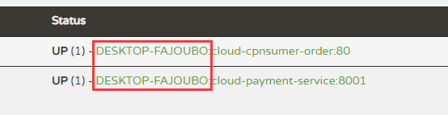
* 含有主机名称

#### 解决

* YML补充eureka.instance.instance-id指定实例id即可

### 访问信息有ip信息提示

* 微服务点击跳转链接，并没有携带真实ip地址
* 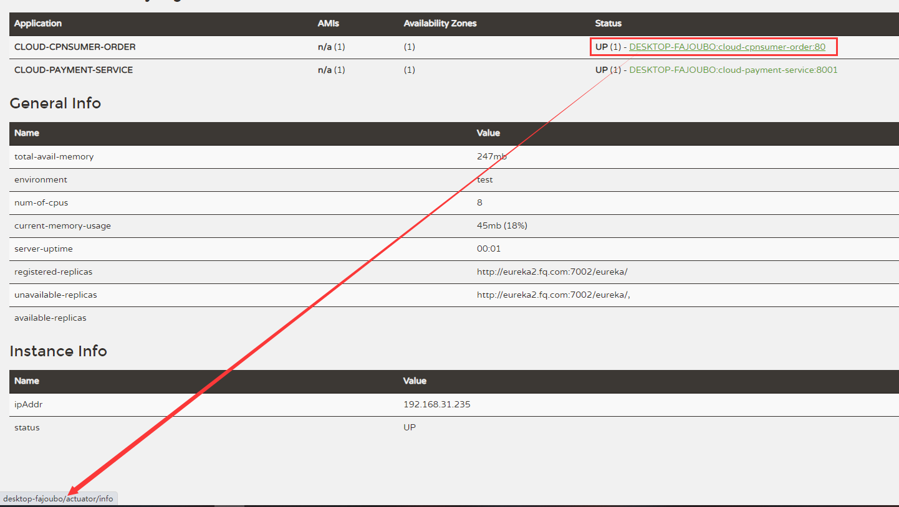
* 在YML中补充eureka.instance.prefer-ip-address，即可自动获取本机ip，生效于eureka可视化界面的链接上 

## 服务发现Discovery

* 对于注册进eureka里面的微服务，可以通过服务发现来获得改服务的信息

  * 通过注入DiscoveryClient的bean
  * getServices方法可以获取注册中心注册的全部服务名称
  * getInstances(服务名) 可以获取具体的服务名称的实例，返回一个ServiceInstance类型的List
  * ServiceInstance类型有如下的方法
    *  getServiceId方法，获取服务id
    *  getHost方法 获取主机地址
    *  getPort方法 获取端口号
    *  getUri方法 获取整体的访问链接

* 8001主启动类

  * 要想以上的功能有效，需要在主启动类上使用EnableDiscoveryClient注解开启

* 自测

  * postman请求http://127.0.0.1:8001/payment/discovery

  * 后台打印

  * ```java
    2021-03-11 01:45:50.086  INFO 5108 --- [nio-8001-exec-1] c.f.s.controller.PaymentController       : *************elemnet:cloud-cpnsumer-order
    2021-03-11 01:45:50.086  INFO 5108 --- [nio-8001-exec-1] c.f.s.controller.PaymentController       : *************elemnet:cloud-payment-service
    2021-03-11 01:45:50.087  INFO 5108 --- [nio-8001-exec-1] c.f.s.controller.PaymentController       : CLOUD-PAYMENT-SERVICE	192.168.31.235	8002	http://192.168.31.235:8002
    2021-03-11 01:45:50.087  INFO 5108 --- [nio-8001-exec-1] c.f.s.controller.PaymentController       : CLOUD-PAYMENT-SERVICE	192.168.31.235	8001	http://192.168.31.235:8001
    ```

## Eureka自我保护机制

### 概述

* 保护模式主要用于一组客户端和EurekaServer之间存在网络分区场景下的保护，一旦进入保护模式，EurekaServer将会尝试保护其服务注册表中信息，不会删除服务注册表中的数据，也就是不会注销任何微服务

* 如果EurekaServer的首页看到以下这段提示，则说明Eureka进入了保护模式：

* #### **EMERGENCY! EUREKA MAY BE INCORRECTLY CLAIMING INSTANCES ARE UP WHEN THEY'RE NOT. RENEWALS ARE LESSER THAN THRESHOLD AND HENCE THE INSTANCES ARE NOT BEING EXPIRED JUST TO BE SAFE.**

* 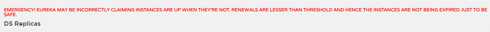

* **一句话说明：某时刻某一个微服务可不用了，Eureka不会立刻清理，依旧会对微服务的信息进行保存**

* 属于CAP里面的AP分支

### 为什么这么设计

* 为什么会产生Eureka自我保护机制
  * 为了防止EurekaClient可以正常运行，但是与EurekaServer网络不通的情况下，EurekaServer不会立刻将EurekaClient服务剔除
* 什么是自我保护机制
  * 默认情况下，如果EurekaServer在一定时间内没有接受到某个微服务实例的心跳，EurekaServer将会注销该实例（默认90秒）。但是当网络分区故障发生（延迟，卡顿，拥挤）时，微服务与EurekaServer之间无法正常通信，以上行为可能变得危险--因为微服务本身其实是健康的，此时本不应该注销这个微服务。Eureka通过“自我保护模式”来解决这个问题--当EurekaServer节点在短时间丢失过多客户端时（可能发生了网络分区故障），那么这个节点就会进入自我保护模式

### 如何关闭自我保护

* ​	注册中心
  * eureka.server.enable-self-preservation（开启自我保护机制）默认为true，改为false
  * eviction-interval-timer-in-ms（收到心跳的间隔）默认为60秒（2.2.7版本），改为2000毫秒
  * 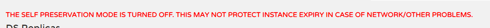

* 客户端
  *  eureka.instance.lease-renewal-interval-in-seconds（客户端向服务端发送心跳的间隔）默认为30秒，修改为1秒
  *  eureka.instance.lease-expiration-duration-in-seconds（服务端在收到最后一次心跳后等待的时间上限，默认为90秒，超时则剔除服务）改为2秒