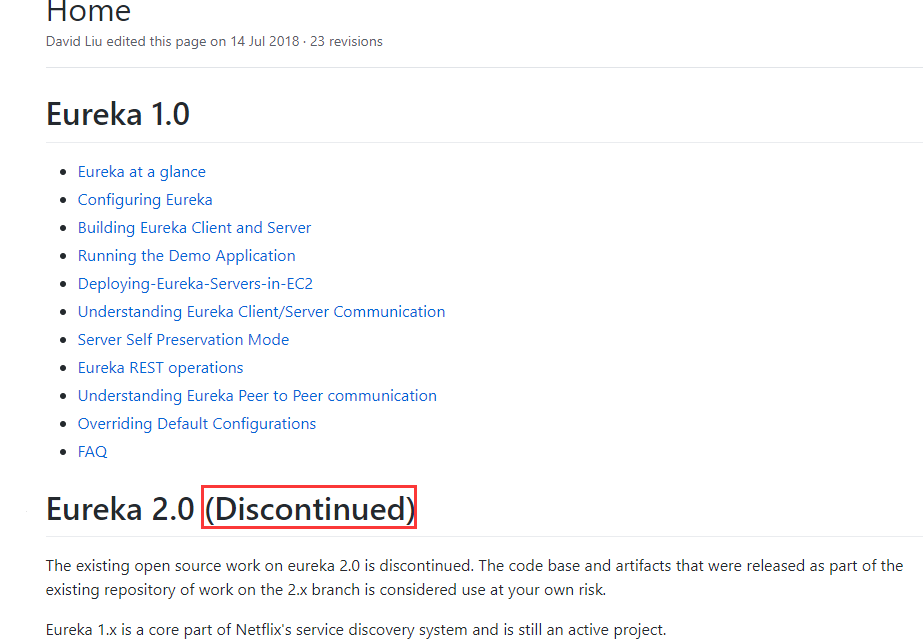
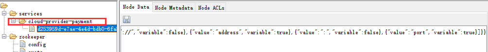

# Zoopeeper服务注册与发现

## Eurekat停止更新如何选型 

### 停更说明

* [github 说明](https://github.com/Netflix/eureka/wiki)
* 

## SpringCloud整合Zookeeper代替Eureka

### 注册中心Zookeeper 

* zookeeper是一个分布式协调工具，可以实现注册中心功能
* 关闭Linux服务器防火墙自动Zookeeper服务器
* Zookeeper服务器取代Eureka服务器，zk作为服务注册中心

### 服务提供者 

#### 新建cloud-provider-payment8004 

#### POM 

* 其他的与Eureka项目一致，只需要将eureka更换成zookeeper-starter

* ```xml
  <!-- zookeeper 的spring cloud依赖 -->
  <dependency>
      <groupId>org.springframework.cloud</groupId>
      <artifactId>spring-cloud-starter-zookeeper-discovery</artifactId>
  </dependency>
  ```

#### YML 

* ```yaml
  server:
    port: 8004
  
  spring:
    application:
      name: cloud-provider-payment
    cloud:
      zookeeper:
        connect-string: 192.168.31.200:2181
  ```

#### 主启动类 

*  @EnableDiscoveryClient注解是Spring cloud官方定义的开启服务发现的注解

* zookeeper-starter遵循了Spring cloud 的相关规范，使用@EnableDiscoveryClient可以开启服务注册与发现功能

* ```java
  @SpringBootApplication
  @EnableDiscoveryClient
  public class PaymentApplication {
  
      public static void main(String[] args) {
          SpringApplication.run(PaymentApplication.class, args);
      }
  
  }
  ```

#### Controller  

* ```java
  @RestController
  @Slf4j
  public class PaymentController {
  
      @Value("${server.port}")
      private String port;
  
      @PostMapping("/payment/zk")
      public String insert() {
          return "spring cloud with zookeeper" + port + "\t" + UUID.randomUUID().toString();
      }
  
  
  }
  ```

#### 启动8004注册到zookeeper

#### 验证测试 

* 启动后发现zookeeper出现了新的节点
* 

#### 验证测试2 

* 对zookeeper的json进行分析

* ```json
  {
      "name":"cloud-provider-payment",
      "id":"d253959d-e7ae-4e4d-bdb0-6fa813f7f6c3",
      "address":"DESKTOP-FAJOUBO",
      "port":8004,
      "sslPort":null,
      "payload":{
          "@class":"org.springframework.cloud.zookeeper.discovery.ZookeeperInstance",
          "id":"application-1",
          "name":"cloud-provider-payment",
          "metadata":{
              "instance_status":"UP"
          }
      },
      "registrationTimeUTC":1615655298583,
      "serviceType":"DYNAMIC",
      "uriSpec":{
          "parts":[
              {
                  "value":"scheme",
                  "variable":true
              },
              {
                  "value":"://",
                  "variable":false
              },
              {
                  "value":"address",
                  "variable":true
              },
              {
                  "value":":",
                  "variable":false
              },
              {
                  "value":"port",
                  "variable":true
              }
          ]
      }
  }
  ```

#### 思考

### 服务消费者